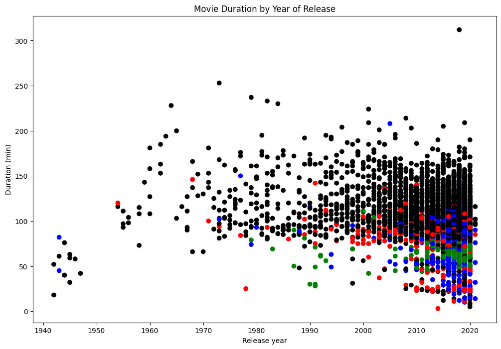

<center></center>

**Netflix**! What started in 1997 as a DVD rental service has since exploded into one of the largest entertainment and media companies.

Given the large number of movies and series available on the platform, it is a perfect opportunity to flex your data manipulation skills and dive into the entertainment industry. Our friend has also been brushing up on their Python skills and has taken a first crack at a CSV file containing Netflix data. They have been performing some analyses, and they believe that the average duration of movies has been declining. Using your friends initial research, you'll delve into the Netflix data to if you can explain some of the factors that may be contributing to the shortening movie lengths.

You have been supplied with the dataset `netflix_data.csv` , along with the following table detailing the column names and descriptions:

## The data
### **netflix_data.csv**
| Column | Description |
|--------|-------------|
| `show_id` | The ID of the show |
| `type` | Type of show |
| `title` | Title of the show |
| `director` | Director of the show |
| `cast` | Cast of the show |
| `country` | Country of origin |
| `date_added` | Date added to Netflix |
| `release_year` | Year of Netflix release |
| `duration` | Duration of the show |
| `description` | Description of the show |
| `genre` | Show genre |


```python
# Importing pandas and matplotlib
import pandas as pd
import matplotlib.pyplot as plt

# Start coding!
```


```python
netflix_df = pd.read_csv('netflix_data.csv')
```


```python
netflix_df.head()
```


<div>
<style scoped>
    .dataframe tbody tr th:only-of-type {
        vertical-align: middle;
    }

    .dataframe tbody tr th {
        vertical-align: top;
    }

    .dataframe thead th {
        text-align: right;
    }
</style>
<table border="1" class="dataframe">
  <thead>
    <tr style="text-align: right;">
      <th></th>
      <th>show_id</th>
      <th>type</th>
      <th>title</th>
      <th>director</th>
      <th>cast</th>
      <th>country</th>
      <th>date_added</th>
      <th>release_year</th>
      <th>duration</th>
      <th>description</th>
      <th>genre</th>
    </tr>
  </thead>
  <tbody>
    <tr>
      <th>0</th>
      <td>s1</td>
      <td>TV Show</td>
      <td>3%</td>
      <td>NaN</td>
      <td>João Miguel, Bianca Comparato, Michel Gomes, R...</td>
      <td>Brazil</td>
      <td>August 14, 2020</td>
      <td>2020</td>
      <td>4</td>
      <td>In a future where the elite inhabit an island ...</td>
      <td>International TV</td>
    </tr>
    <tr>
      <th>1</th>
      <td>s2</td>
      <td>Movie</td>
      <td>7:19</td>
      <td>Jorge Michel Grau</td>
      <td>Demián Bichir, Héctor Bonilla, Oscar Serrano, ...</td>
      <td>Mexico</td>
      <td>December 23, 2016</td>
      <td>2016</td>
      <td>93</td>
      <td>After a devastating earthquake hits Mexico Cit...</td>
      <td>Dramas</td>
    </tr>
    <tr>
      <th>2</th>
      <td>s3</td>
      <td>Movie</td>
      <td>23:59</td>
      <td>Gilbert Chan</td>
      <td>Tedd Chan, Stella Chung, Henley Hii, Lawrence ...</td>
      <td>Singapore</td>
      <td>December 20, 2018</td>
      <td>2011</td>
      <td>78</td>
      <td>When an army recruit is found dead, his fellow...</td>
      <td>Horror Movies</td>
    </tr>
    <tr>
      <th>3</th>
      <td>s4</td>
      <td>Movie</td>
      <td>9</td>
      <td>Shane Acker</td>
      <td>Elijah Wood, John C. Reilly, Jennifer Connelly...</td>
      <td>United States</td>
      <td>November 16, 2017</td>
      <td>2009</td>
      <td>80</td>
      <td>In a postapocalyptic world, rag-doll robots hi...</td>
      <td>Action</td>
    </tr>
    <tr>
      <th>4</th>
      <td>s5</td>
      <td>Movie</td>
      <td>21</td>
      <td>Robert Luketic</td>
      <td>Jim Sturgess, Kevin Spacey, Kate Bosworth, Aar...</td>
      <td>United States</td>
      <td>January 1, 2020</td>
      <td>2008</td>
      <td>123</td>
      <td>A brilliant group of students become card-coun...</td>
      <td>Dramas</td>
    </tr>
  </tbody>
</table>
</div>


```python
netflix_subset = netflix_df[netflix_df['type'] == 'Movie']
```


```python
netflix_subset.head()
```


<div>
<style scoped>
    .dataframe tbody tr th:only-of-type {
        vertical-align: middle;
    }

    .dataframe tbody tr th {
        vertical-align: top;
    }

    .dataframe thead th {
        text-align: right;
    }
</style>
<table border="1" class="dataframe">
  <thead>
    <tr style="text-align: right;">
      <th></th>
      <th>show_id</th>
      <th>type</th>
      <th>title</th>
      <th>director</th>
      <th>cast</th>
      <th>country</th>
      <th>date_added</th>
      <th>release_year</th>
      <th>duration</th>
      <th>description</th>
      <th>genre</th>
    </tr>
  </thead>
  <tbody>
    <tr>
      <th>1</th>
      <td>s2</td>
      <td>Movie</td>
      <td>7:19</td>
      <td>Jorge Michel Grau</td>
      <td>Demián Bichir, Héctor Bonilla, Oscar Serrano, ...</td>
      <td>Mexico</td>
      <td>December 23, 2016</td>
      <td>2016</td>
      <td>93</td>
      <td>After a devastating earthquake hits Mexico Cit...</td>
      <td>Dramas</td>
    </tr>
    <tr>
      <th>2</th>
      <td>s3</td>
      <td>Movie</td>
      <td>23:59</td>
      <td>Gilbert Chan</td>
      <td>Tedd Chan, Stella Chung, Henley Hii, Lawrence ...</td>
      <td>Singapore</td>
      <td>December 20, 2018</td>
      <td>2011</td>
      <td>78</td>
      <td>When an army recruit is found dead, his fellow...</td>
      <td>Horror Movies</td>
    </tr>
    <tr>
      <th>3</th>
      <td>s4</td>
      <td>Movie</td>
      <td>9</td>
      <td>Shane Acker</td>
      <td>Elijah Wood, John C. Reilly, Jennifer Connelly...</td>
      <td>United States</td>
      <td>November 16, 2017</td>
      <td>2009</td>
      <td>80</td>
      <td>In a postapocalyptic world, rag-doll robots hi...</td>
      <td>Action</td>
    </tr>
    <tr>
      <th>4</th>
      <td>s5</td>
      <td>Movie</td>
      <td>21</td>
      <td>Robert Luketic</td>
      <td>Jim Sturgess, Kevin Spacey, Kate Bosworth, Aar...</td>
      <td>United States</td>
      <td>January 1, 2020</td>
      <td>2008</td>
      <td>123</td>
      <td>A brilliant group of students become card-coun...</td>
      <td>Dramas</td>
    </tr>
    <tr>
      <th>6</th>
      <td>s7</td>
      <td>Movie</td>
      <td>122</td>
      <td>Yasir Al Yasiri</td>
      <td>Amina Khalil, Ahmed Dawood, Tarek Lotfy, Ahmed...</td>
      <td>Egypt</td>
      <td>June 1, 2020</td>
      <td>2019</td>
      <td>95</td>
      <td>After an awful accident, a couple admitted to ...</td>
      <td>Horror Movies</td>
    </tr>
  </tbody>
</table>
</div>


```python
netflix_movies = netflix_subset[["title", "country", "genre", "release_year", "duration"]]
```


```python
netflix_movies.head()
```


<div>
<style scoped>
    .dataframe tbody tr th:only-of-type {
        vertical-align: middle;
    }

    .dataframe tbody tr th {
        vertical-align: top;
    }

    .dataframe thead th {
        text-align: right;
    }
</style>
<table border="1" class="dataframe">
  <thead>
    <tr style="text-align: right;">
      <th></th>
      <th>title</th>
      <th>country</th>
      <th>genre</th>
      <th>release_year</th>
      <th>duration</th>
    </tr>
  </thead>
  <tbody>
    <tr>
      <th>1</th>
      <td>7:19</td>
      <td>Mexico</td>
      <td>Dramas</td>
      <td>2016</td>
      <td>93</td>
    </tr>
    <tr>
      <th>2</th>
      <td>23:59</td>
      <td>Singapore</td>
      <td>Horror Movies</td>
      <td>2011</td>
      <td>78</td>
    </tr>
    <tr>
      <th>3</th>
      <td>9</td>
      <td>United States</td>
      <td>Action</td>
      <td>2009</td>
      <td>80</td>
    </tr>
    <tr>
      <th>4</th>
      <td>21</td>
      <td>United States</td>
      <td>Dramas</td>
      <td>2008</td>
      <td>123</td>
    </tr>
    <tr>
      <th>6</th>
      <td>122</td>
      <td>Egypt</td>
      <td>Horror Movies</td>
      <td>2019</td>
      <td>95</td>
    </tr>
  </tbody>
</table>
</div>


```python
short_movies = netflix_movies[netflix_movies.duration < 60]
```


```python
short_movies
```


<div>
<style scoped>
    .dataframe tbody tr th:only-of-type {
        vertical-align: middle;
    }

    .dataframe tbody tr th {
        vertical-align: top;
    }

    .dataframe thead th {
        text-align: right;
    }
</style>
<table border="1" class="dataframe">
  <thead>
    <tr style="text-align: right;">
      <th></th>
      <th>title</th>
      <th>country</th>
      <th>genre</th>
      <th>release_year</th>
      <th>duration</th>
    </tr>
  </thead>
  <tbody>
    <tr>
      <th>35</th>
      <td>#Rucker50</td>
      <td>United States</td>
      <td>Documentaries</td>
      <td>2016</td>
      <td>56</td>
    </tr>
    <tr>
      <th>55</th>
      <td>100 Things to do Before High School</td>
      <td>United States</td>
      <td>Uncategorized</td>
      <td>2014</td>
      <td>44</td>
    </tr>
    <tr>
      <th>67</th>
      <td>13TH: A Conversation with Oprah Winfrey &amp; Ava ...</td>
      <td>NaN</td>
      <td>Uncategorized</td>
      <td>2017</td>
      <td>37</td>
    </tr>
    <tr>
      <th>101</th>
      <td>3 Seconds Divorce</td>
      <td>Canada</td>
      <td>Documentaries</td>
      <td>2018</td>
      <td>53</td>
    </tr>
    <tr>
      <th>146</th>
      <td>A 3 Minute Hug</td>
      <td>Mexico</td>
      <td>Documentaries</td>
      <td>2019</td>
      <td>28</td>
    </tr>
    <tr>
      <th>...</th>
      <td>...</td>
      <td>...</td>
      <td>...</td>
      <td>...</td>
      <td>...</td>
    </tr>
    <tr>
      <th>7679</th>
      <td>WWII: Report from the Aleutians</td>
      <td>United States</td>
      <td>Documentaries</td>
      <td>1943</td>
      <td>45</td>
    </tr>
    <tr>
      <th>7692</th>
      <td>Ya no estoy aquí: Una conversación entre Guill...</td>
      <td>NaN</td>
      <td>Documentaries</td>
      <td>2020</td>
      <td>15</td>
    </tr>
    <tr>
      <th>7718</th>
      <td>Yoo Byung Jae: Discomfort Zone</td>
      <td>South Korea</td>
      <td>Stand-Up</td>
      <td>2018</td>
      <td>54</td>
    </tr>
    <tr>
      <th>7771</th>
      <td>Zion</td>
      <td>United States</td>
      <td>Documentaries</td>
      <td>2018</td>
      <td>12</td>
    </tr>
    <tr>
      <th>7784</th>
      <td>Zulu Man in Japan</td>
      <td>NaN</td>
      <td>Documentaries</td>
      <td>2019</td>
      <td>44</td>
    </tr>
  </tbody>
</table>
<p>420 rows × 5 columns</p>
</div>


```python
colors = []
for label, row in netflix_movies.iterrows() :
    if row["genre"] == "Children" :
        colors.append("red")
    elif row["genre"] == "Documentaries" :
        colors.append("blue")
    elif row["genre"] == "Stand-Up":
        colors.append("green")
    else:
        colors.append("black")

```


```python
fig = plt.figure(figsize=(12,8))
plt.scatter(netflix_movies.release_year, netflix_movies.duration, c=colors)

# Create a title and axis labels
plt.title("Movie Duration by Year of Release")
plt.xlabel("Release year")
plt.ylabel("Duration (min)")
plt.show()
```


    

    


```python
len(netflix_movies)
```


    5377


```python
# Are we certain that movies are getting shorter?
answer = 'maybe'
```
